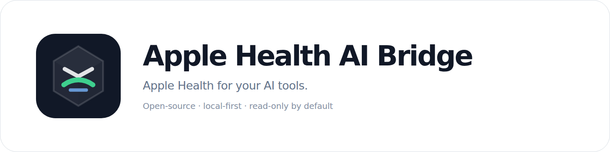

<div align="center">
  
  <p><strong>Your Apple Health data, continuously available to your own AI agent.</strong></p>
  <p>
    <a href="https://healthbridge.chanhyo.dev/install/">Install the iPhone app</a> ·
    <a href="docs/setup.md">Set up your bridge</a> ·
    <a href="docs/supported-health-data.md">Supported health data</a> ·
    <a href="https://healthbridge.chanhyo.dev/">Website</a>
  </p>
</div>

---

Apple Health AI Bridge gives you a direct, self-hosted path from Apple Health to the AI tools you choose—without routing it through a hosted intermediary. The iPhone companion continuously sends the HealthKit data you permit to a receiver you control, where read-only CLI and MCP interfaces make it available to compatible agents.

Your health data stays under your control: the receiver and database run on your infrastructure, AI access is read-only, and no hosted relay or third-party model is required.

## Set up the bridge

You need:

- an iPhone running iOS 18 or later;
- a macOS or Linux computer that your iPhone can reach over a trusted LAN or private network; native Windows is not currently supported;
- an MCP client on that machine, or a terminal for direct CLI access;
- [`uv`](https://docs.astral.sh/uv/) for the receiver package.

### 1. Install the iPhone app

Open the [official TestFlight install page](https://healthbridge.chanhyo.dev/install/) on your iPhone and tap the verified public invitation. Health Bridge publishes this repository and website only after the matching TestFlight build is approved and the invitation has been verified anonymously.

### 2. Install and prepare the bridge

After `v1.0.0` appears on the project's GitHub Releases page, run this on the machine that will host the receiver and MCP server:

```bash
uv tool install "git+https://github.com/roian6/apple-health-ai-bridge.git@v1.0.0"
health-bridge setup \
  --receiver-url https://your-private-host.example/v1/batches
```

`health-bridge setup`:

- creates a private local SQLite database and single-use pairing page;
- prepares the receiver command;
- emits a canonical same-host stdio MCP access descriptor;
- verifies the local Health Bridge MCP server;
- detects available client adapters without modifying their configuration;
- prints only secret-redacted paths, commands, and status.

Adding a client creates another process that can read the private health database, so setup never does that automatically. Use an explicit `--configure-client <name>` only after choosing the client. Other same-host MCP clients can render the canonical descriptor into their own documented config format; Health Bridge is not limited to its bundled adapters.

The pairing page itself is secret material. Never paste it into chat, commit it, or host it publicly.

### 3. Pair and sync

1. Start the receiver using the command printed by `health-bridge setup`.
2. On the receiver computer, open the generated pairing HTML on a trusted screen.
   For a headless receiver, securely copy that file to a trusted local screen; never
   publish it or place it on a public web server.
3. Scan the QR with iPhone Camera, open the setup link, and connect the companion app.
4. Tap **Allow Health Access** and review Apple’s native authorization sheet.
5. Enable **Automatic Sync**.
6. Wait for the first successful upload, then ask your agent about your data.

Example prompts:

- “Show yesterday’s workouts and wake-date sleep.”
- “Which Apple Health metrics have synced recently?”
- “Summarize my last seven days of activity and mark any source or sync gaps.”

## What is supported

The companion requests every HealthKit type that is both implemented by the app and available on the current iOS runtime. Unsupported or unavailable types remain absent rather than being fabricated.

See the versioned [supported health data reference](docs/supported-health-data.md).

## Agent surface

The MCP server is read-only and exposes bounded, source-grounded tools:

- bridge and sync status;
- supported and currently synced metric catalogs;
- time-series observations;
- workouts;
- sleep summaries;
- daily summaries;
- source provenance.

It does not expose raw SQL, token material, cursor values, or clinical recommendations.

## Privacy and security

- HealthKit access is read-only.
- The receiver and SQLite database are user-owned.
- The project has no hosted health-data backend.
- Pairing invitations are temporary and single-use.
- Device credentials are stored in the iOS Keychain and hashed at rest by the receiver.
- Logs and agent status omit health values and credentials by default.
- The receiver is designed for one trusted user, not mutually untrusted tenants.

Do not expose the receiver or pairing page to the public internet. Prefer a trusted LAN, Tailscale, or another private network with HTTPS where practical.

Report vulnerabilities through GitHub’s private vulnerability reporting flow described in [SECURITY.md](SECURITY.md).

Public policies and help: [Privacy](https://healthbridge.chanhyo.dev/privacy) · [Support](https://healthbridge.chanhyo.dev/support)

### Remove local bridge data

Stop the receiver, then inspect the exact deletion scope with the default dry-run:

```bash
health-bridge receiver purge --db ~/.local/share/health-bridge/health.sqlite
```

Run the same command with `--confirm` only after reviewing the listed database and SQLite sidecars. Confirmation is refused while the receiver is still using the database. This removes the local bridge copy and does not delete Apple Health data. Empty private `.lifecycle.lock` and `.access.lock` coordination files and a private `.purge-*` directory containing zero-byte tomb files may remain; they contain no health records.

If the command returns `recovery-required`, do not restart the receiver. Review the structured source, quarantine, and truncated path lists; the command deliberately keeps the private quarantine instead of claiming a rollback after an irreversible partial purge.

## Releases

User installs are pinned to a signed version tag instead of the moving `main` branch. Each GitHub Release publishes the exact-tag wheel and source archive together with SHA-256 checksums, build provenance, and metadata that ties the Python package, iOS version/build, Git tree, and batch schema together. The first coordinated public release is `v1.0.0`, paired with iOS `1.0.0 (15)`.

## Build from source

TestFlight is the normal iPhone installation path. Contributors and advanced users can build with Xcode 16 or later by following [docs/self-build.md](docs/self-build.md).

## Documentation

- [Setup](docs/setup.md)
- [Supported health data](docs/supported-health-data.md)
- [Architecture and trust boundaries](docs/architecture.md)
- [Brand guide](docs/brand.md)
- [Batch contract](docs/reference/batch-v1.md)
- [SQLite schema](docs/reference/sqlite-v1.md)
- [Build the iOS app](docs/self-build.md)

## Development

```bash
uv sync --all-extras --dev --locked
uv run pytest -q
uv run ruff check .
uv run basedpyright
```

Synthetic fixtures and smoke commands are contributor tools, not part of user onboarding. See [CONTRIBUTING.md](CONTRIBUTING.md).

Apple Health AI Bridge is an independent open-source project and is not affiliated with, endorsed by, or sponsored by Apple Inc.

## License

Apache-2.0. See [LICENSE](LICENSE).
